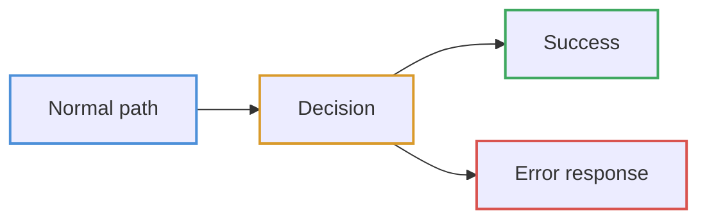

# Diagrams

Request flows through the API, drawn from the code rather than from intent.
Every diagram is Mermaid, so GitHub, VS Code and most Markdown viewers render
them without a build step.

| Diagram | Answers |
| --- | --- |
| [Middleware stack](middleware-stack.md) | What touches a request before a view sees it, and why the order is what it is |
| [Read request](read-request.md) | How `GET /api/v1/stones/` becomes a paginated JSON page |
| [Write request](write-request.md) | How a `POST` is validated, persisted, stamped and audited |
| [Authentication](authentication.md) | Register, login, refresh rotation, logout and password change |
| [Permissions](permissions.md) | How a user, their groups and a request method resolve to allow or deny |
| [Query layer](query-layer.md) | How `search`, `filter[...]`, `ordering` and the trashed flags compose |
| [Soft delete and audit](soft-delete-audit.md) | Why a delete is an update, and what compensates for it |
| [Error handling](error-handling.md) | Every exception type and the response it becomes |
| [Health checks](health-checks.md) | What liveness and readiness actually test |

## Reading these

Boxes name real modules. Where a box says `apps/core/filters.py`, that file
exists and does what the box claims — if you change one, change the other.

Meaning is carried by the **border** colour, never by a fill. Backgrounds and
text are left to the viewer's theme, so every node matches the surrounding page
— dark in a dark IDE, light on GitHub — instead of a light box floating on a
dark background.

| Border | Meaning |
| --- | --- |
| Blue | Entry point or normal path |
| Amber | Decision |
| Green | Success |
| Red | Error or failure |

