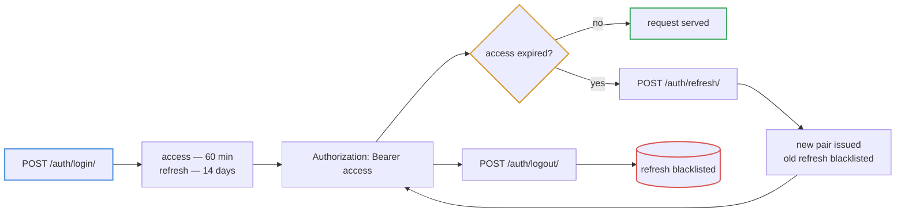
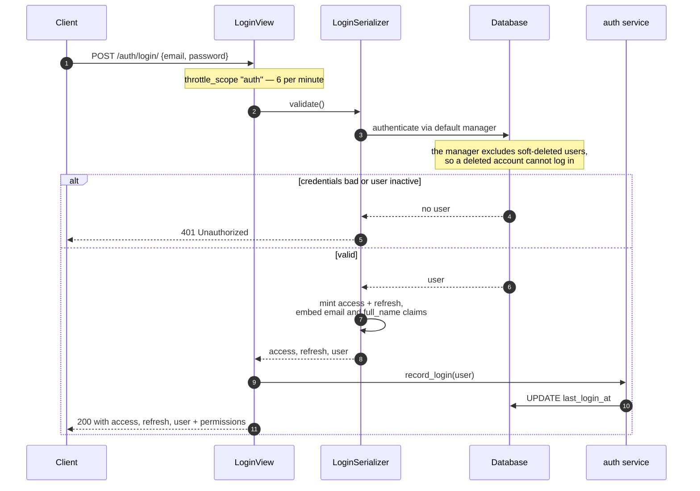
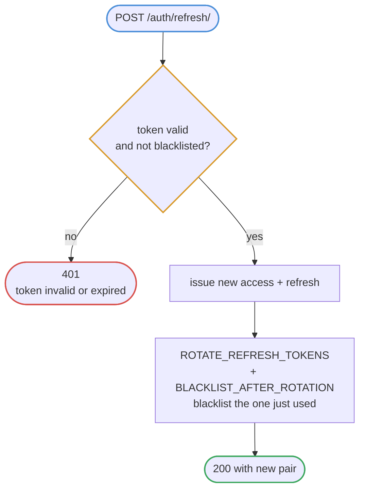
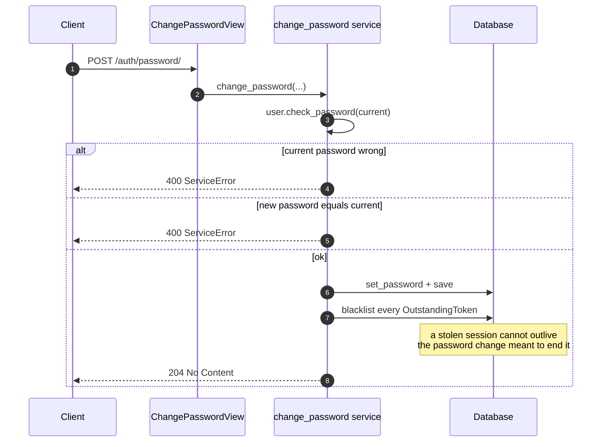
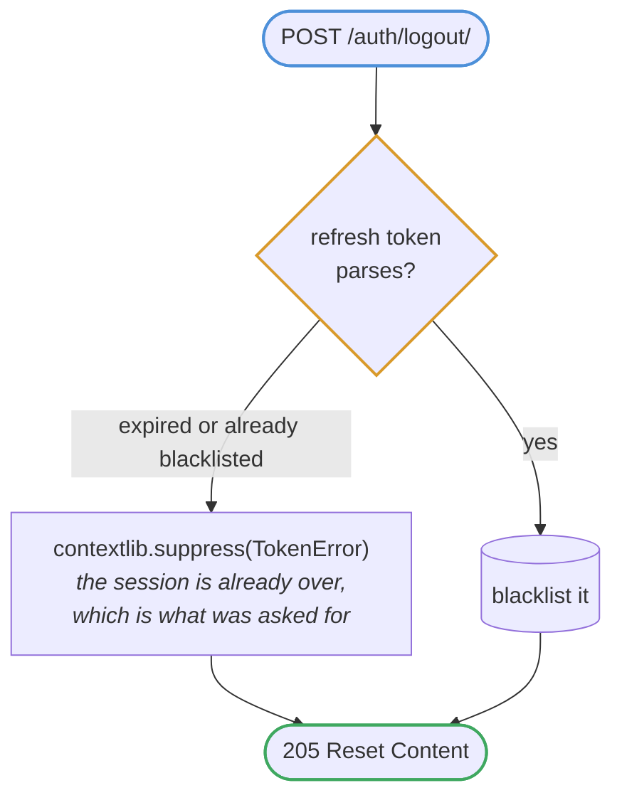
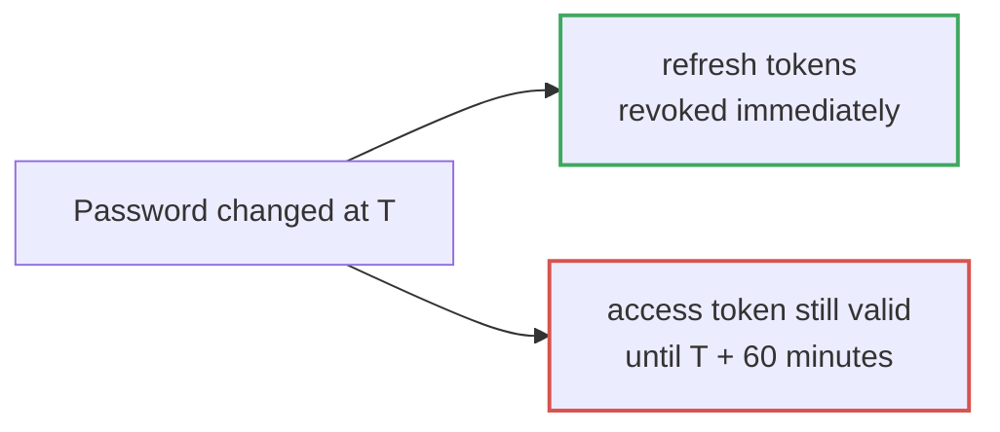

# Authentication

JWT via `djangorestframework-simplejwt`, with rotation and blacklisting on.

## Token lifecycle

## Login

The response embeds the serialised user **and their permission list**, which
saves the client an immediate follow-up call to `/auth/me/` just to render a
name and decide which nav items to show.

## Refresh with rotation

Each refresh token is single-use. A replayed one is already blacklisted, which
is how a stolen refresh token gets detected rather than silently reused.

## Password change and session revocation

## Logout

## The revocation gap

Blacklisting acts on **refresh** tokens. An already-issued **access** token
stays valid until it expires:

`JWT_ACCESS_MINUTES` **is** that exposure window — a security parameter, not a
performance knob. Shorten it where an immediate lockout matters; the cost is
more refresh round-trips.
