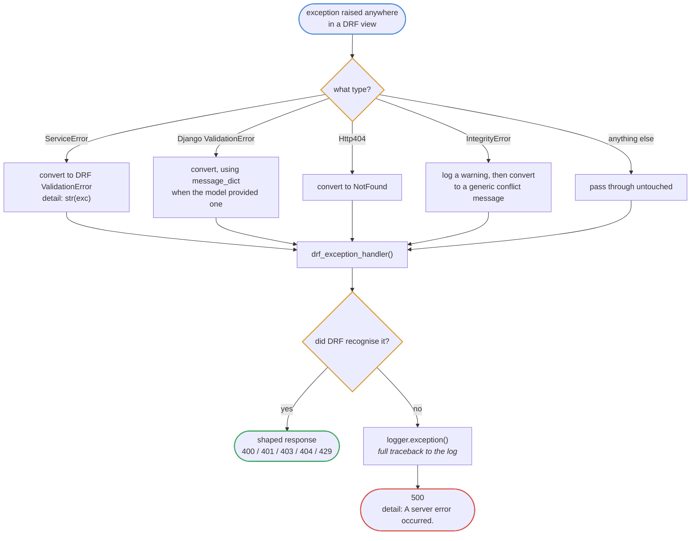
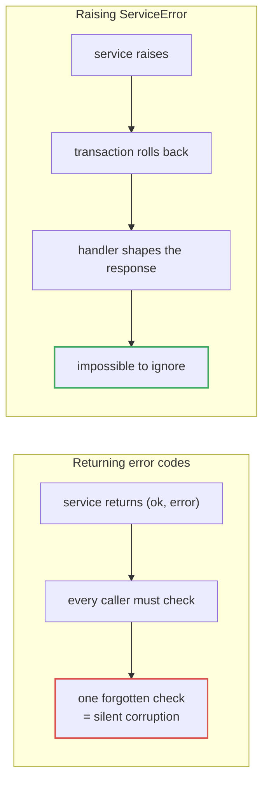
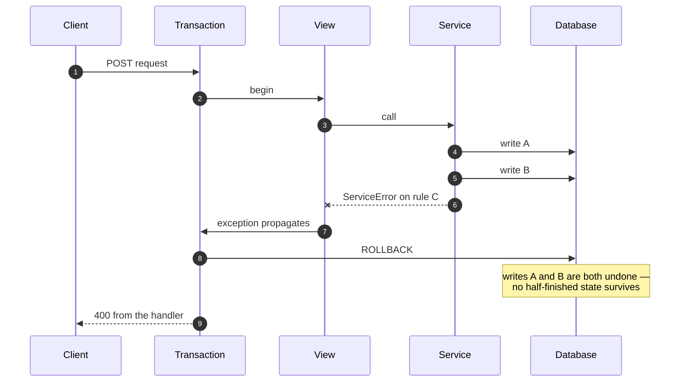

# Error handling

`apps/core/handlers.py` is the single funnel every exception passes through.
It is wired in as `EXCEPTION_HANDLER`, so no view has to shape its own errors.

## The funnel

The 500 branch is the important one. An unrecognised exception is logged **in
full**, with its traceback, and reported to the client as a bare sentence.
Internals — table names, file paths, SQL fragments — never reach the caller.

## Status code map

| Raised | Status | Body |
| --- | --- | --- |
| `ServiceError` | 400 | `{"detail": "..."}` |
| Django `ValidationError` | 400 | field-keyed |
| Serializer validation | 400 | field-keyed |
| Not authenticated | 401 | `{"detail": "..."}` |
| Permission denied | 403 | `{"detail": "..."}` |
| `Http404` / missing object | 404 | `{"detail": "Not found."}` |
| `IntegrityError` | 400 | generic conflict message, warning logged |
| Throttled | 429 | `{"detail": "..."}` |
| Anything unhandled | 500 | generic message, traceback logged |

## Why services raise rather than return

`ServiceError` carries no HTTP knowledge, so the same service works unchanged
from a management command, a webhook or a test.

## Transaction interaction

`ATOMIC_REQUESTS = True` wraps every request in a transaction.

This is why services that write more than one row do not need their own
`try`/`except` cleanup: a raised exception unwinds the whole request.
