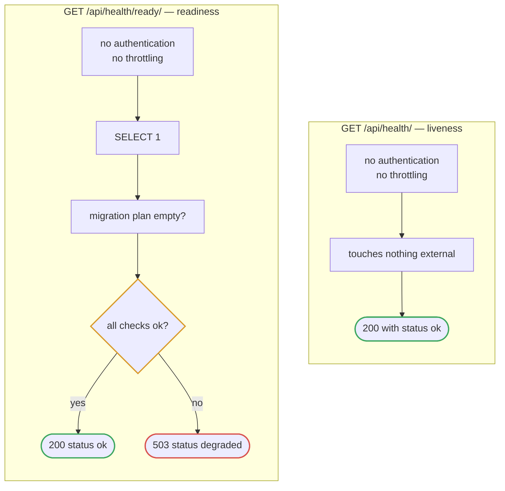
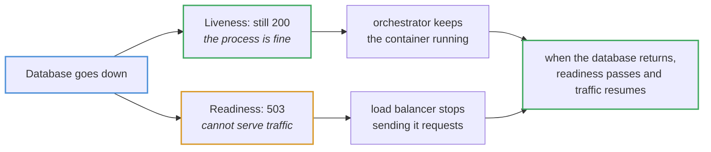
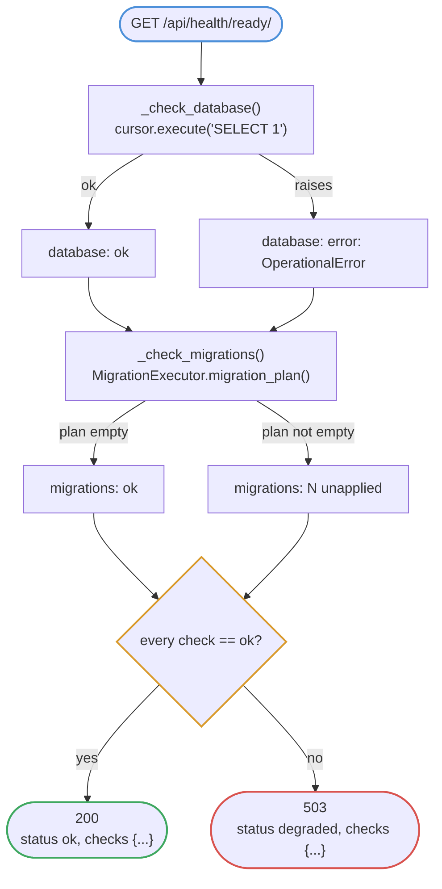

# Health checks

Two probes at `/api/health/` and `/api/health/ready/`, mounted **outside** the
`/api/v1/` prefix so a version bump cannot break your infrastructure.

## Liveness versus readiness

## Why they are separate

A liveness probe that queried the database would fail during any outage, and the
orchestrator would respond by **restarting healthy containers** — turning a
recoverable dependency blip into a restart storm. Keeping liveness dependency-free
is the whole point of having two endpoints.

## Readiness checks

The migration check catches the deploy that starts a container against a
half-migrated schema — a failure that otherwise surfaces as scattered
`ProgrammingError`s on unrelated endpoints, hours later.

The response names **which** check failed rather than returning a bare 503, so
the on-call reader knows whether to look at the database or the deploy pipeline.

## Deliberate 503, not 500

An exception inside a probe would produce a 500, which reads as an application
bug and, on some load balancers, still routes traffic. A 503 is the documented
signal for "temporarily unable to serve", and is what makes a rolling deploy
hold back.
