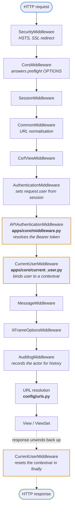
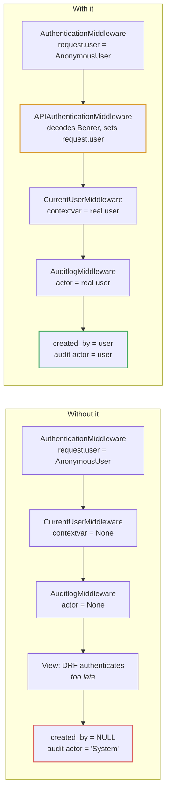

# Middleware stack

Every request passes down this stack before routing, and back up it on the way
out. Order is declared in `config/settings/base.py` and is not arbitrary.

## Why the order matters

**`CorsMiddleware` sits second**, immediately after security. It has to answer a
preflight `OPTIONS` request before `CommonMiddleware` gets a chance to redirect
or rewrite it. Placed lower, preflights fail in ways that surface in the browser
as an opaque CORS error with no server-side trace.

**`APIAuthenticationMiddleware` exists because DRF authenticates too late.**
DRF resolves the token inside the view, during `dispatch()`. Both middlewares
below it read `request.user`, and would otherwise see `AnonymousUser` on every
token-authenticated request:

An invalid token is swallowed there deliberately — DRF authenticates again in
the view and owns turning a bad token into a properly shaped 401.

**`CurrentUserMiddleware` resets in a `finally` block.** Without the reset, a
reused worker thread would leak the previous request's user into the next one,
stamping `created_by` with the wrong person.
