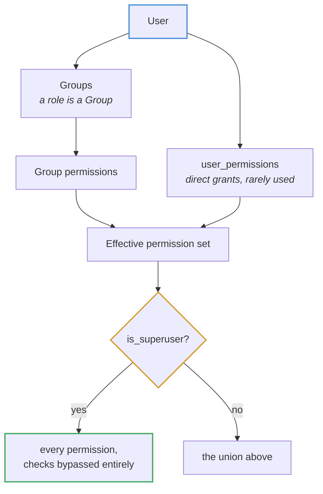
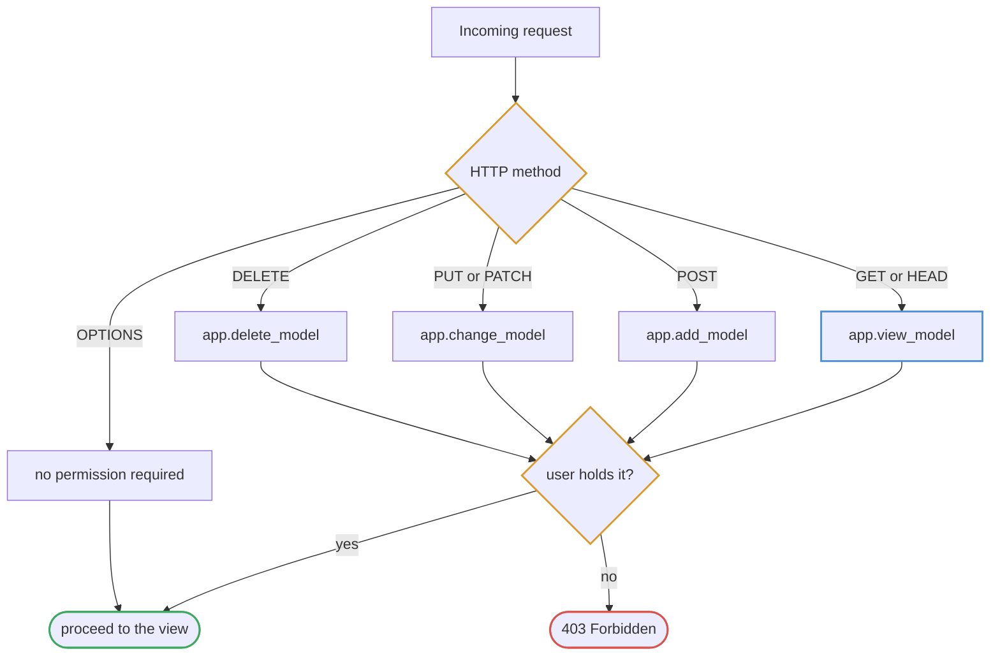
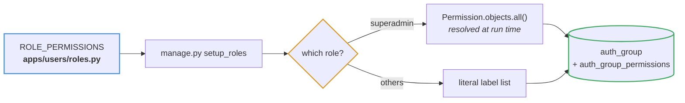
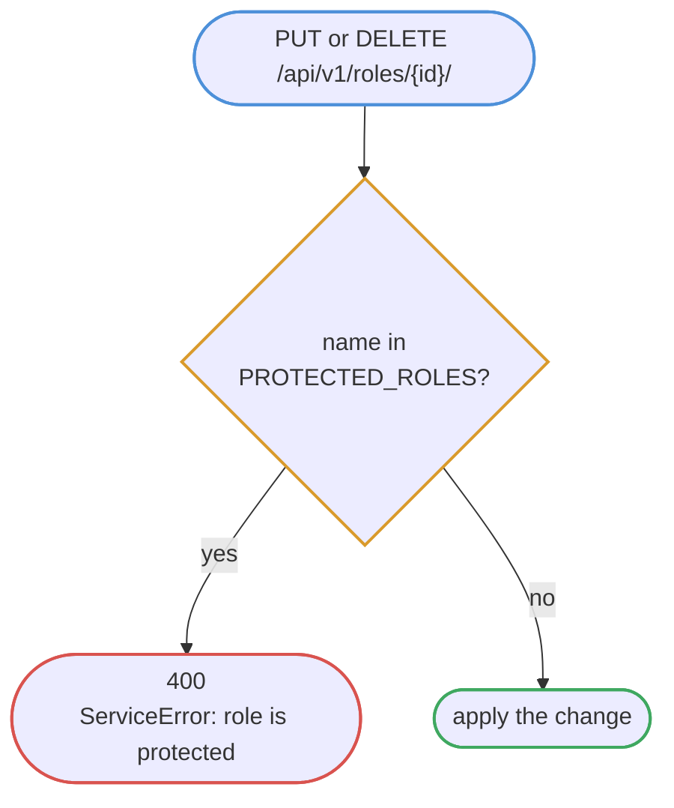
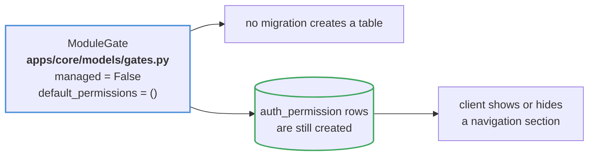

# Permissions

Plain Django `Group` and `Permission`. No custom role tables, no `django-guardian`.

## Resolution

## Method to permission

`StrictModelPermissions` in `apps/core/permissions.py`:

The `GET` row is the whole reason this class exists. DRF's stock
`DjangoModelPermissions` maps `GET` to **no permission at all**, so any
authenticated user — including one with an empty role — could read every record.
Requiring `view_<model>` closes that hole, and
`test_user_without_permissions_cannot_even_read` pins the behaviour.

`restore` maps to `change_<model>`: bringing a row back is a state change, and a
dedicated `restore_<model>` would have to be declared on every model in the
project for no real gain.

## Roles

Defined in code at `apps/users/roles.py`, applied by `manage.py setup_roles`,
which is idempotent and safe to re-run.

| Role | Scope |
| --- | --- |
| `superadmin` | Every permission, resolved dynamically |
| `administrator` | Full CRUD across the domain, users, roles, audit read |
| `receptionist` | Customers and orders; registers and types stones |
| `editor` | Catalog add / change / view — no delete |
| `accountant` | Bills, payments, service providers, and pricing |

Keeping the matrix in code rather than in seed data means a role change arrives
as a reviewable diff.

## Protected roles

`superadmin` is the escape hatch that repairs a broken permission setup. Letting
it be renamed, deleted or narrowed would allow an administrator to lock everyone
out of the system irrecoverably.

## Module gates

Four permissions guard whole UI sections rather than tables: `module_user`,
`module_orders`, `module_billing`, `module_settings`, `module_audit`. They have no table of their
own, so they hang off an **unmanaged** model.

Django creates permission rows for unmanaged models too, which is precisely what
makes this work. The same trick carries `audit.view_systemlog` in
`apps/audit/models.py`.
