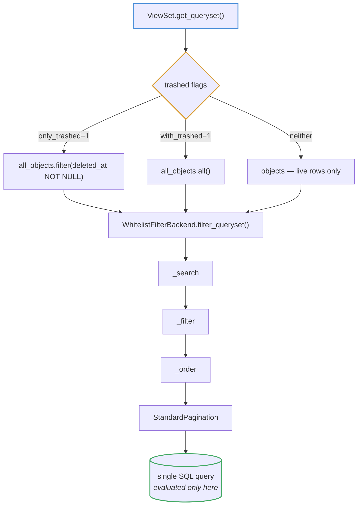
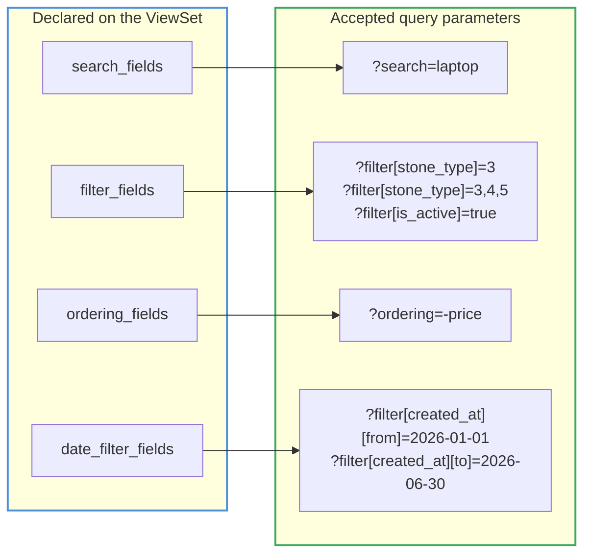
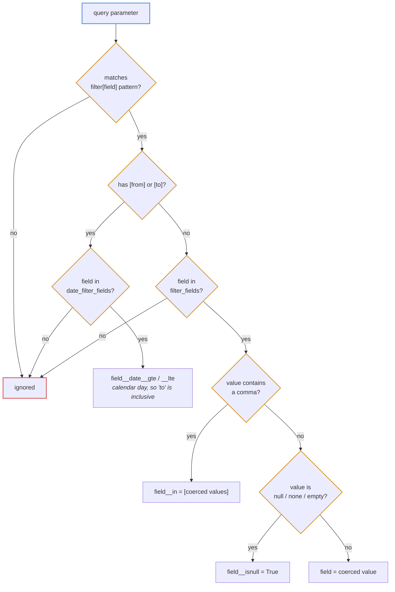
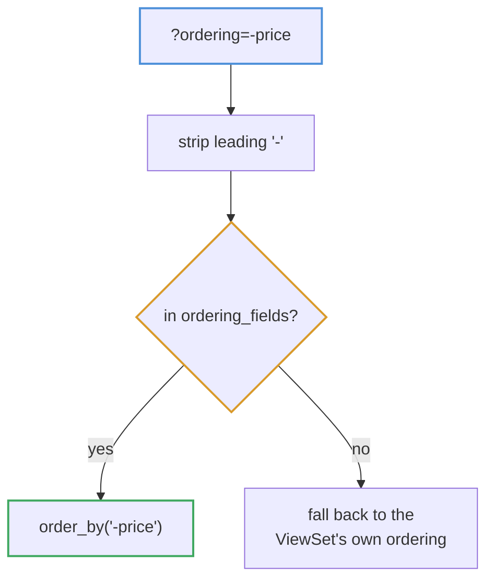

# Query layer

One filter backend serves every list endpoint. Instead of a `FilterSet` class
per model, each ViewSet publishes four plain whitelists and
`apps/core/filters.py` reads them.

## Composition order



Trashed handling lives in the **ViewSet**, not the backend, because switching
managers has to happen before the view attaches its `select_related` and
`prefetch_related` — which the backend never sees.

Everything above is lazy. No query runs until pagination slices the queryset, so
the three stages compose into one statement.

## The four whitelists



Whitelisting is the point. Query parameters name real database columns, so an
open-ended implementation would let a client filter or order by **any** field on
the model — including ones it has no business reading.

## Per-parameter handling



An un-whitelisted parameter is **ignored, not rejected**. A stricter design
would 400 on an unknown filter; ignoring keeps old clients working after a field
is removed. The trade-off is that a typo in a filter name silently returns
unfiltered data — worth knowing when debugging "why is this returning everything".

Values are coerced: `true`/`false`/`1`/`0`/`yes`/`no` become booleans, and
`null`/`none` become an `IS NULL` lookup.

### Params that deliberately sit outside `filter[...]`

A viewset may read a **bare** query param in its own `get_queryset`, and the
orders endpoint reads two:

```
GET /orders/?identification=pending|complete
GET /orders/?stage=awaiting_payment
```

Neither is an oversight. `filter[field]` is a *field lookup* the whitelist
validates against `filter_fields`, and this predicate compares two columns —
`Count(stones)` against `stone_count` — which no field lookup can express.
Routing it through `filter[...]` would make the whitelist a liar about what it
checks. The predicate itself lives in `apps/orders/selectors.py` alongside the
worklist that shares it, so the screen and the queue cannot drift.

`?stage=` is the same situation, one step further. An order's stage is
**derived** from its stones and its bill rather than stored (see
[business-workflow.md](../domain/business-workflow.md)), so there is no column
to filter on at all. `orders_at_stage()` re-expresses the derivation as SQL with
`Exists`/`OuterRef`, and a test asserts it agrees with the Python version across
every stage — which is what makes keeping the value derived affordable.

The two **combine** — `?stage=on_hold&identification=complete` means both. A
hold or a cancellation outranks identification in the derivation, so a stage
filter on its own can still return orders with stones left to type; the
Identification screen, which lists only finished identification, relies on
sending both.

Like every other unknown parameter, an unrecognised value is ignored.

## Ordering



A default ordering always applies. Without one, PostgreSQL may return rows in
any order it likes, and pagination over an unordered set can show the same row
on two pages while omitting another entirely.

## Schema

`get_schema_operation_parameters()` advertises `search`, `ordering` and every
`filter[...]` key to drf-spectacular, so the whitelists appear in Swagger UI
rather than being undocumented tribal knowledge.
