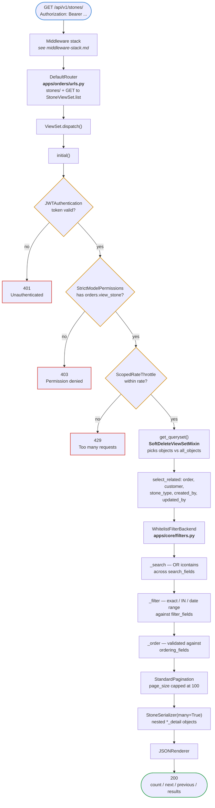

# Read request

`GET /api/v1/stones/?search=ruby&ordering=label&page_size=20`

## The three gates, in order

DRF always runs authentication, then permissions, then throttling. The ordering
is deliberate: you cannot decide what someone may do until you know who they
are, and there is no point rate-limiting a request that was going to be refused
anyway.

`DEFAULT_PERMISSION_CLASSES` is `IsAuthenticated`, so a view that forgets to
declare its own permissions **fails closed** rather than open.

## Why the eager loading appears before the filter

`select_related` and `prefetch_related` are declared on the ViewSet's
`queryset`, so they are already attached when the filter backend receives it.
Both are lazy — nothing executes until pagination slices the queryset — so the
joins compose with whatever the filter added.

Without them, serialising one page of 15 stones would issue dozens of queries
instead of a handful. `test_listing_stones_does_not_n_plus_one` asserts a
ceiling of 12 queries, so a regression fails the suite rather than quietly
slowing production.
