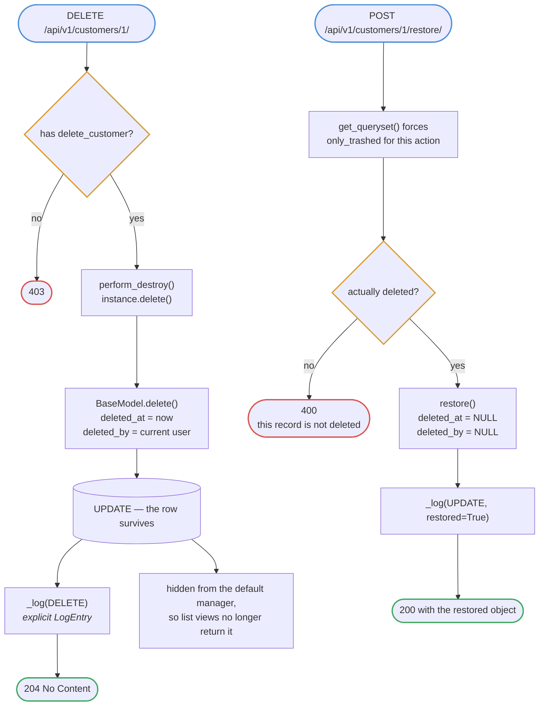
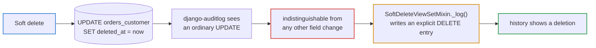
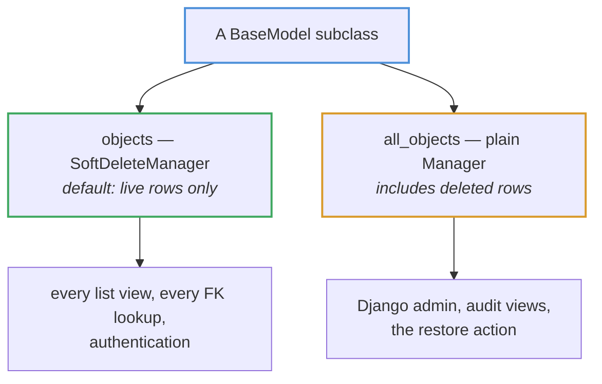
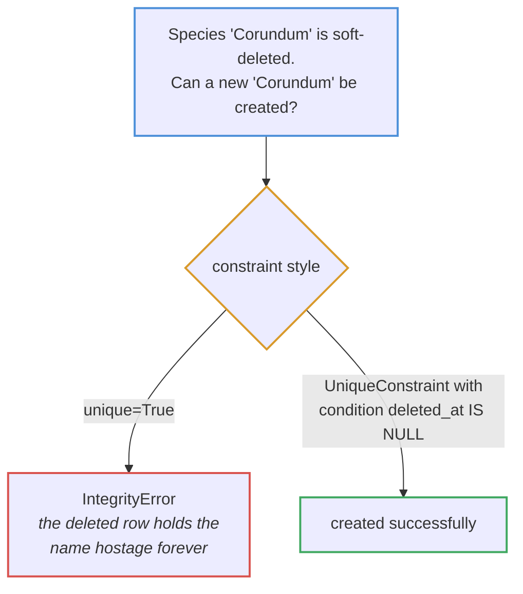
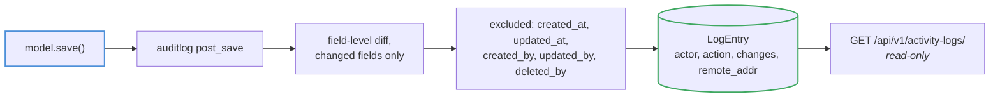

# Soft delete and audit

Rows are never physically removed by ordinary code paths. `delete()` stamps
`deleted_at` instead.

## Delete and restore

The restore action forces `only_trashed`, because the row it needs to find is
one that every other view deliberately hides.

## Why an explicit log entry is needed

This is the cost of pairing a custom soft delete with an off-the-shelf audit
library. Nothing was physically deleted, so `post_delete` never fires.

## Manager selection

Because `objects` is the **default** manager, a soft-deleted user cannot
authenticate — the login lookup simply does not find them. That falls out of the
manager choice rather than needing its own check.

## Partial unique constraints

Every natural key in the project uses the partial form — `name` on
`ReferenceModel`, plus `reference_number`, `bill_number`, `trx_id` and the
certificate's number and token. A plain
`unique=True` on a soft-deletable model is a bug waiting to be filed as "cannot
create, says it already exists, but I deleted it".

## What lands in the audit trail

Registration is automatic: `apps/core/audit.py` walks the app registry and
registers every concrete `BaseModel` subclass, so a new model is audited the
moment it inherits the base. `deleted_at` stays tracked — it is the field that
makes soft deletes visible in the history at all.

The activity-log API is read-only by design. An audit trail that can be edited
is not an audit trail.
