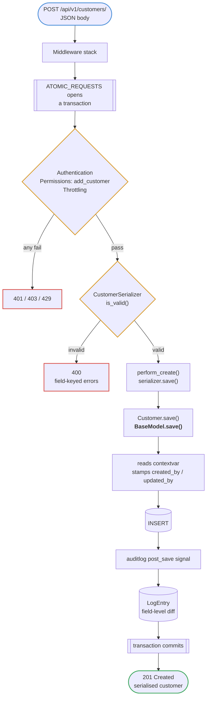
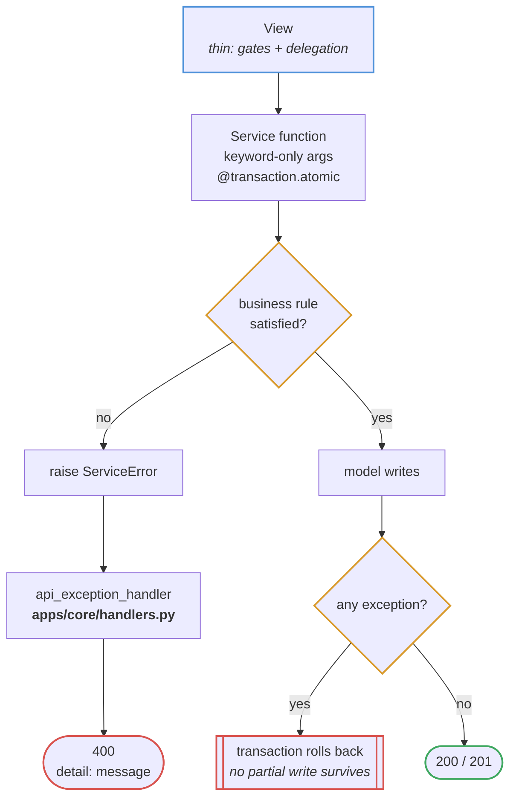

# Write request

`POST /api/v1/customers/` — and the service-layer variant beneath it.

## When a service is involved

Anything spanning more than one model, or carrying a business rule, goes through
`apps/<app>/services/`. Services know nothing about HTTP — they raise
`ServiceError`, and one handler maps it to a status code.

## Where the actor comes from

`BaseModel.save()` never receives the request user as an argument. It reads the
contextvar that `CurrentUserMiddleware` set, which is what keeps the model layer
free of any HTTP knowledge.

One subtlety worth knowing: when a caller passes `update_fields`, the stamped
columns are **added to that set**. A naive implementation computes `updated_by`
and then hands Django an `update_fields` list that excludes it — the value is
calculated and then silently discarded. `test_partial_save_still_stamps_the_actor`
guards exactly that.
