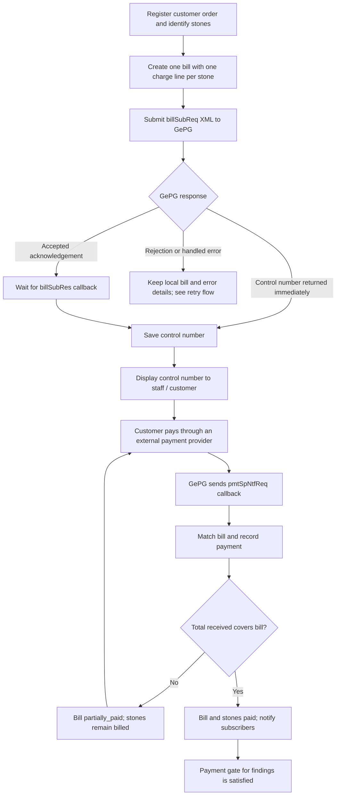
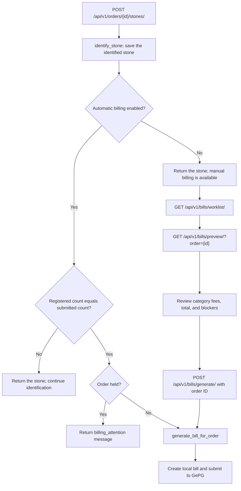
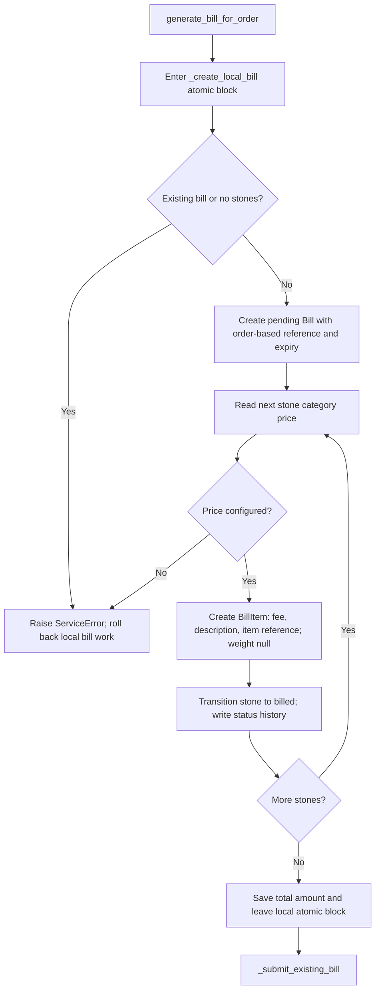
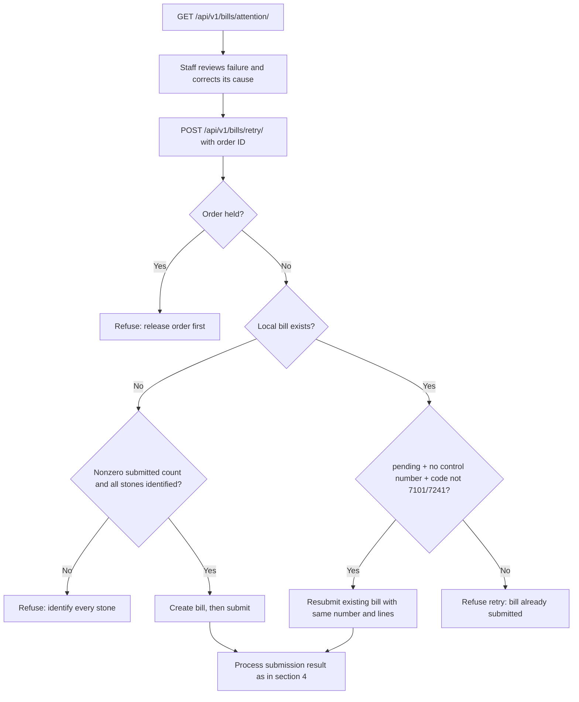
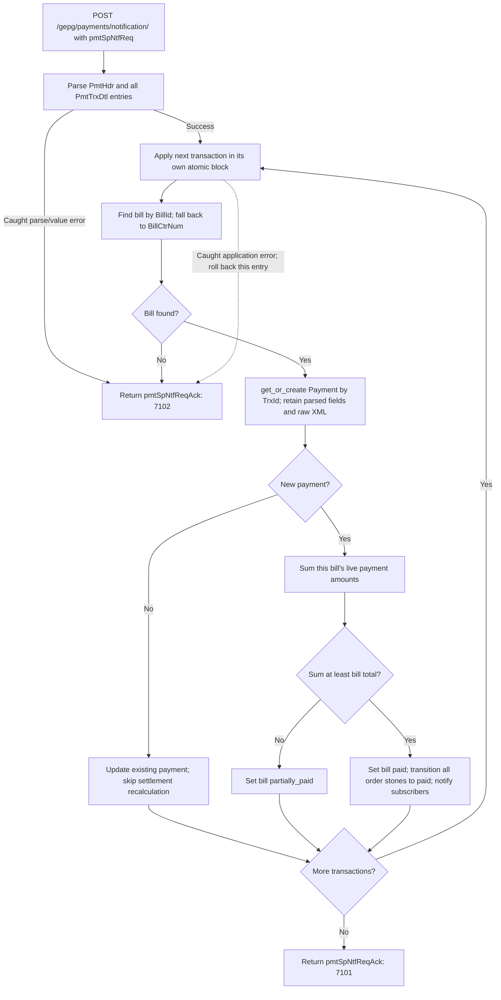
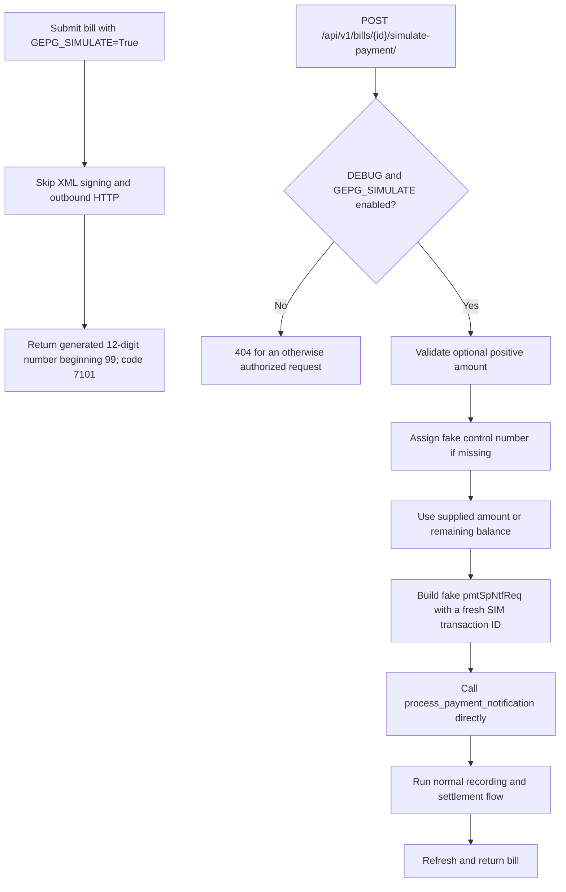
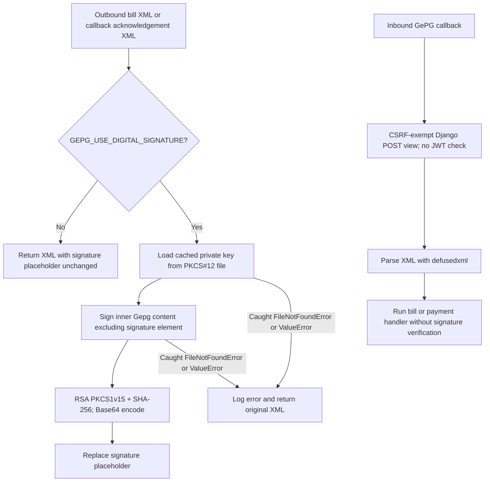

# GePG flows in the current system

This guide traces the workspace implementation reviewed on 2026-10-08. It describes application behavior, including its current gaps; it is not a specification of the complete GePG protocol. Open it in a Markdown viewer with Mermaid support to see the diagrams.

## Reading map

1. [End-to-end flow](#1-end-to-end-flow)
2. [Manual and automatic billing](#2-manual-and-automatic-billing)
3. [Local bill creation](#3-local-bill-creation)
4. [Submission and immediate responses](#4-submission-and-immediate-responses)
5. [Asynchronous control-number callback](#5-asynchronous-control-number-callback)
6. [Failed billing and retries](#6-failed-billing-and-retries)
7. [Payment notifications and duplicate handling](#7-payment-notifications-and-duplicate-handling)
8. [Payment and stone states](#8-payment-and-stone-states)
9. [Offline simulation](#9-offline-simulation)
10. [Signing and callback boundaries](#10-signing-and-callback-boundaries)
11. [Endpoint and source map](#11-endpoint-and-source-map)
12. [Unimplemented flows and important limits](#12-unimplemented-flows-and-important-limits)

## 1. End-to-end flow

The system creates the **bill number**, which identifies the local charge. GePG supplies the **control number**, which the customer uses to pay. A control number is not evidence of payment: the separate payment notification updates settlement.



Customer payment through a bank/mobile provider is external context. This repository does not initiate that transaction. Payment does not itself create findings or issue a certificate.

## 2. Manual and automatic billing

`AUTO_BILL_AFTER_IDENTIFICATION` selects the entry path; its settings default is `False`. This guide does not assert which value a deployed environment uses.



- The manual worklist selects orders with every submitted stone registered and no bill. Preview is read-only and reports an existing bill, an empty order, or missing category prices as blockers.
- The manual generation service itself checks for an existing bill, no stones, and missing prices; it does not repeat the worklist's complete-identification check or the automatic path's held-order check.
- Identification requires `orders.add_stone`. Automatic billing runs as part of that action without a separate `billing.generate_bill` check. Manual preview/generation and retry actions require `billing.generate_bill`.
- In automatic mode, manual generation and the manual worklist return 404. A handled pricing failure preserves identification and returns `billing_attention`; an unsuccessful submission can return a bill plus an attention message.

Sources: [identification service](../../apps/billing/services/identification.py), [API views](../../apps/billing/views.py), [worklist selectors](../../apps/billing/selectors.py).

## 3. Local bill creation

The charge is a fixed fee from each stone's **category**, not its weight or individual stone type. Bill items snapshot the price so future price changes do not rewrite an existing bill.



The bill defaults to `TZS`; expiry is issuance plus `GEPG_BILL_EXPIRY_DAYS` (default 365). One bill belongs to one order, with multiple items and payments.

**Transaction boundary:** `ATOMIC_REQUESTS=True` wraps API views in a database transaction. Leaving `_create_local_bill()` is therefore not necessarily a database commit. The outbound HTTP request can happen before the enclosing request commits. A handled gateway failure returns normally, allowing the local bill to persist; an unhandled exception can roll back the request.

Sources: [bill service](../../apps/billing/services/bill.py), [bill models](../../apps/billing/models/bill.py), [database settings](../../config/settings/base.py).

## 4. Submission and immediate responses

```mermaid
sequenceDiagram
    participant S as Bill service
    participant A as GePG adapter
    participant G as GePG
    participant DB as Database
    S->>A: submit_bill(bill, customer, username)
    alt GEPG_SIMULATE is true
        A-->>S: Generated control number; code 7101
    else Real submission
        A->>A: Build billSubReq; sign if enabled
        A->>G: POST GEPG_BILL_CREATE_URL (30-second timeout)
        alt billSubRes contains a control number
            G-->>A: BillCntrNum and status fields
            A-->>S: Synchronous result with control number
        else billSubReqAck code is 7101 or 7241
            G-->>A: Accepted acknowledgement
            A-->>S: Success with internal PENDING marker
        else Rejection or handled transport / XML error
            G-->>A: Rejection, invalid response, or HTTP failure
            A-->>S: Failure result with diagnostic code
        end
    end
    S->>DB: Save attempt timestamp, status_code, status_desc
    opt Successful result has a real control number
        S->>DB: Save control_number
    end
    Note over S,DB: Bill payment status remains pending
```

Connection failures and timeouts also take the handled transport-error branch, even if GePG sends no response.

The XML contains `BillHdr`, `BillDtls/BillDtl`, and item details. Amounts have two decimal places; customer text is escaped and phone numbers normalized. Current fixed values include `BillPayOpt=3`, `MinPayAmt=full bill amount`, and `ExchRate=1.00`. Provider identifiers come from settings, even when a `ServiceProvider` record is attached to the bill.

HTTP headers are `Content-Type: application/xml`, `Gepg-Com: default.sp.in`, and `Gepg-Code: GEPG_SP_CODE`.

| Result | Local behavior |
| --- | --- |
| Synchronous `billSubRes` with nonempty `BillCntrNum` | Treat as success based on number presence; store number and raw status fields |
| `billSubReqAck` with `7101` or `7241` | Keep control number empty and wait for callback; internal `PENDING` is not saved as the number |
| Other acknowledgement code | Store rejection details |
| Request/HTTP exception | Store `CONNECTION_ERROR` |
| Caught XML parsing failure | Store `XML_PARSE_ERROR` |
| Unrecognized response structure | Store `UNKNOWN_RESPONSE` |

`is_gepg_submitted=True` means an attempt returned a result, including a failure. It does not prove acceptance. The adapter returns `raw_response` and `is_sync`, but the submission service does not persist them.

Source: [gateway adapter](../../apps/billing/gateways/gepg.py), [submission service](../../apps/billing/services/bill.py).

## 5. Asynchronous control-number callback

```mermaid
sequenceDiagram
    participant G as GePG
    participant W as BillResponseView
    participant S as Bill callback service
    participant DB as Database
    participant UI as Manual generation dialog
    participant API as Bill read API
    G->>W: POST /gepg/bill/response/ with billSubRes
    W->>S: Decode UTF-8 body and handle callback
    S->>S: Parse ResId, BillId, BillCntrNum, status fields
    alt Caught parsing failure
        S-->>W: billSubResAck with ERROR and 7102
    else Parse succeeds
        S->>DB: Find Bill by bill_number = BillId
        opt Matching bill and nonempty control number
            S->>DB: Save control number and gateway status fields
        end
        S-->>W: billSubResAck with ResId and 7101
    end
    W-->>G: HTTP 200; acknowledgement XML
    loop While dialog query is active and number is missing
        UI->>API: GET /api/v1/bills/{id}/ every 3 seconds
        API->>DB: Read current bill
        DB-->>API: Bill fields
        API-->>UI: Serialized bill including control_number
    end
```

Polling reads local state and does not ask GePG for a new number. The manual dialog stops its polling interval once a number appears.

A parseable callback for an unknown bill, or one without a control number, still gets `7101` without updating a bill. A supplied number is saved without checking that `BillStsCode` indicates success. Only the first matching `BillDtl` is parsed. These are current implementation behaviors, not recommended protocol guarantees.

Sources: [callback service](../../apps/billing/services/bill.py), [webhooks](../../apps/billing/webhooks.py), [frontend dialog](../../../frontend/src/features/orders/components/generate-bill-dialog.tsx).

## 6. Failed billing and retries

Retry is an explicit staff action exposed in automatic mode. There is no scheduled retry worker.



The attention worklist selects active, fully identified orders with either no bill or a bill matching the retry condition. Retrying an existing bill preserves its prices and stone statuses. Both attention and retry endpoints return 404 in manual mode.

An accepted asynchronous bill with no control number is **not** a retry candidate. If its callback never arrives, the current implementation has no automatic recovery flow.

Sources: [retry service](../../apps/billing/services/bill.py), [attention selector](../../apps/billing/selectors.py), [API mode checks](../../apps/billing/views.py).

## 7. Payment notifications and duplicate handling

An acknowledgement confirms callback handling. The bill's status separately indicates whether enough money has been received.



**Identical redelivery:** the same `TrxId` updates the existing row and skips settlement, avoiding another payment and repeated settlement side effects. The database uniqueness constraint applies to nonempty transaction IDs on live rows. The parser does not require a nonempty ID, so this guarantee should not be generalized to malformed transactions.

**Changed redelivery:** a different amount under an existing `TrxId` overwrites the stored payment but does not recalculate bill status. This is not a correction/reconciliation workflow.

**Multiple entries:** parsing happens before application. Once application starts, an earlier successful entry can survive a later entry's failure and the resulting `7102`. Each application has an atomic block; the loop does not guarantee all-or-nothing processing of the whole notification. With `ATOMIC_REQUESTS`, successful earlier work can commit when the view returns the handled failure acknowledgement normally.

Handled responses use HTTP 200 and `text/xml; charset=utf-8`; the XML code carries success (`7101`) or failure (`7102`). Uncaught exceptions can still produce a server error instead of an acknowledgement, for example invalid decimal amounts during parsing.

Sources: [payment service](../../apps/billing/services/payment.py), [parser and acknowledgement builder](../../apps/billing/gateways/gepg.py), [payment model](../../apps/billing/models/bill.py).

## 8. Payment and stone states

```mermaid
stateDiagram-v2
    [*] --> pending: Local bill created; stones become billed
    pending --> pending: Submission result or control-number callback
    pending --> partially_paid: New payment; cumulative amount below total
    partially_paid --> partially_paid: Another new payment; still below total
    pending --> paid: New payment; cumulative amount covers total
    partially_paid --> paid: New payment; cumulative amount covers total
    paid --> paid: Additional new payment; cumulative amount still covers total
```



This diagram assumes ordinary positive payments; inbound amount validation is limited. Duplicate transaction IDs do not take these settlement transitions.

| Event | Bill state | Stone effect |
| --- | --- | --- |
| Local bill created | `pending` | Transition to `billed` and record history |
| Submission fails or waits for callback | Remains `pending` | Remain `billed` |
| Control number received | Remains `pending` | No payment transition |
| New payment leaves cumulative sum below total | `partially_paid` | No stone transition |
| New payment brings cumulative sum to or above total | `paid` | Transition all order stones to `paid`; notify bill-paid subscribers |
| Same transaction redelivered | No recalculation | No transition |

`transition_stone()` does nothing when the stone is already in the target state. New transactions reaching the full-payment branch can still invoke notifications again. `cancelled` and `expired` are defined bill choices, but this integration does not transition bills into them.

Sources: [payment service](../../apps/billing/services/payment.py), [stone transitions](../../apps/orders/services/stone.py), [status definitions](../../apps/gems/enums.py).

## 9. Offline simulation

There are two separate switches/paths: simulated **submission** bypasses GePG HTTP, while simulated **payment** exercises the real local callback handler.



The payment API action also requires `billing.generate_bill`. Passing less than the balance exercises partial payment; omitting the amount uses the remaining balance. Each simulation creates a fresh transaction ID. The helper calls the service directly rather than making an HTTP request to the webhook, and it does not inspect the returned acknowledgement before returning the refreshed bill.

The outbound `GEPG_SIMULATE` check alone does not require `DEBUG`. The frontend reads simulation availability from `/api/v1/config/`.

Sources: [simulation helper](../../apps/billing/dev.py), [API action](../../apps/billing/views.py), [configuration endpoint](../../apps/core/views.py).

## 10. Signing and callback boundaries



The same optional signing helper serves submissions and both acknowledgement types. Other signing exceptions can propagate. `GEPG_PUBLIC_CERT_PATH` is configured but unused: safe XML parsing does not authenticate the sender, and a forged matching payment notification can affect settlement.

Sources: [signing](../../apps/billing/gateways/signing.py), [webhooks](../../apps/billing/webhooks.py).

## 11. Endpoint and source map

Application endpoints are under `/api/v1/`; callbacks are deliberately outside that prefix so their registered URLs remain stable across API versions.

| Endpoint | Role / availability |
| --- | --- |
| `POST /api/v1/orders/{id}/stones/` | Identify a stone; may trigger automatic billing |
| `GET /api/v1/bills/worklist/` | Fully identified, unbilled orders; manual mode |
| `GET /api/v1/bills/preview/?order={id}` | Read-only charge preview |
| `POST /api/v1/bills/generate/` | Create and submit bill; manual mode |
| `GET /api/v1/bills/attention/` | Automatic billing problems; automatic mode |
| `POST /api/v1/bills/retry/` | Create missing bill or resubmit failed bill; automatic mode |
| `GET /api/v1/bills/` and `GET /api/v1/bills/{id}/` | Read bills, amounts, control numbers, and gateway status |
| `GET /api/v1/bills/workflow-feed/` | Existing unpaid bills and relevant pending orders |
| `GET /api/v1/bill-items/` and `GET /api/v1/payments/` | Read charge lines and payment records |
| `POST /api/v1/bills/{id}/simulate-payment/` | Development payment simulation |
| `POST /gepg/bill/response/` | `billSubRes` in; `billSubResAck` out |
| `POST /gepg/payments/notification/` | `pmtSpNtfReq` in; `pmtSpNtfReqAck` out |
| `POST <GEPG_BILL_CREATE_URL>` | Outbound submission from backend to GePG |

Bill/item/payment CRUD is read-only to API clients; the named actions and callback services perform the writes. Service-provider CRUD exists separately at `/api/v1/service-providers/`, but outbound XML currently uses settings for its provider codes.

| Source | Follow it to understand |
| --- | --- |
| [Root URLs](../../config/urls.py), [billing URLs](../../apps/billing/urls.py), [callback URLs](../../apps/billing/urls_webhooks.py) | Routing and callback isolation |
| [Identification service](../../apps/billing/services/identification.py) | Automatic handoff after the last stone |
| [Bill service](../../apps/billing/services/bill.py) | Preview, local creation, submission tracking, retries, control-number callback |
| [Gateway adapter](../../apps/billing/gateways/gepg.py) | Exact XML fields, HTTP transport, parsing, acknowledgement codes |
| [Payment service](../../apps/billing/services/payment.py) | Matching, duplicate handling, partial/full settlement |
| [Models](../../apps/billing/models/bill.py), [serializers](../../apps/billing/serializers.py) | Stored records and exposed API fields |
| [Billing tests](../../apps/billing/tests/test_billing.py), [automatic billing tests](../../apps/billing/tests/test_auto_billing.py) | Existing examples for settlement, redelivery, simulation, and retries |
| [API examples](../../api.http) | Sample requests and callback XML |

## 12. Unimplemented flows and important limits

These limits explain why a flow might stop or behave differently from a full GePG integration:

- **Cancellation, refunds, reconciliation, and SMS:** there is no implemented GePG flow for these. Cancellation and reconciliation URLs exist in settings without callers. Cancelling/holding an order does not cancel its GePG bill or refund money.
- **Expiry:** `expiry_at` is stored and sent, but there is no local expiry worker or automatic bill-state transition.
- **Missing callbacks:** there is no scheduled retry/reconciliation process. Accepted asynchronous submissions remain waiting and cannot use the current retry action.
- **Authentication:** inbound signatures are not verified. Outbound signing can return placeholder XML after caught key/signing failures.
- **Settlement validation:** payment amounts are summed without currency conversion or an `is_processed` filter. The callback does not verify currency agreement, positive payment amounts, or whether the order is held before settlement.
- **Corrections and ordering:** changed duplicate transactions do not recalculate settlement. A fresh payment that reaches the full-payment branch transitions every order stone to `paid`, without a guard against a later workflow state.
- **Concurrency and early callbacks:** submission can run before the request transaction commits, and settlement does not lock the bill while summing payments. The current flow should not be read as a guarantee against early-callback or simultaneous-payment races.
- **Acknowledgement coverage:** unknown bill-response callbacks can receive success without a write; payment processing can partly succeed before a failure acknowledgement. Some parser, signing, and database exceptions remain uncaught.

For configuration details, see the [adapter overview](00_GEPG_INTEGRATION_OVERVIEW.md). For focused prose explanations, see [bill submission](01_BILL_SUBMISSION.md) and [payment notifications](02_PAYMENT_NOTIFICATION.md).
